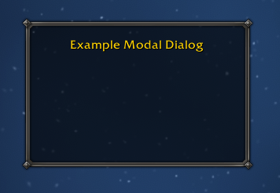
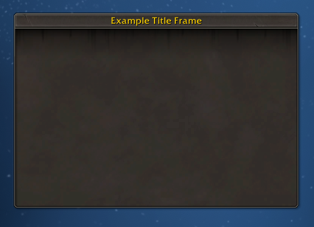

# Frames

XML frame recipes. No logic — just the frame definitions.

| <a href="#bare-frame"><br/>Bare</a> | <a href="#translucent-frame"><br/>Translucent</a> | <a href="#tooltip-frame"><br/>Tooltip</a> | <a href="#modal-dialog"><br/>Modal Dialog</a> |
|:---:|:---:|:---:|:---:|
| <a href="#title-frame"><br/>Title</a> | <a href="#icon-portrait"><br/>Icon Portrait</a> | <a href="#model-portrait"><br/>Model Portrait</a> | |

Also see [Frame Controls](#controls) section:
- [Close button](#close-button)
- [Moveable frame](#moveable-frame)
- [Resizable frame](#resizable-frame)
- [Bottom tabs](#bottom-tabs)

> **Live demo convenience:** Every live demo harness adds drag-to-move and a close button (where the recipe does not already provide them) so you can tile frames and dismiss them without the slash command. These are in the `-- QoL (harness only)` block in each `_harness.lua` and are not part of the recipe.

---

## Bare frame

A minimal frame with a solid background and no border.


### The frame

```xml
<Frame name="ExampleFrameBare" parent="UIParent"
       enableMouse="true"
       frameStrata="MEDIUM" hidden="true">
  <Size x="240" y="160"/>
  <Anchors>
    <Anchor point="CENTER"/>
  </Anchors>
  <Layers>
    <Layer level="BACKGROUND">
      <Texture setAllPoints="true">
        <Color r="0" g="0" b="0" a="1"/>
      </Texture>
    </Layer>
    <Layer level="ARTWORK">
      <FontString name="$parentTitle" inherits="GameFontNormal"
                  text="Example Bare Frame">
        <Anchors>
          <Anchor point="TOP" relativePoint="TOP" y="-16"/>
        </Anchors>
      </FontString>
    </Layer>
  </Layers>
</Frame>
```

### Live demo

Install the addon in [Addons/ExampleFrameBare__Vertex](./Addons/ExampleFrameBare__Vertex/) and use `/ev1` to toggle the frame in-game.

---

## Translucent frame

A bare frame with a translucent background. The game world is visible through it.


### The frame

```xml
<Frame name="ExampleFrameTranslucent" parent="UIParent"
       enableMouse="true"
       frameStrata="MEDIUM" hidden="true">
  <Size x="240" y="160"/>
  <Anchors>
    <Anchor point="CENTER"/>
  </Anchors>
  <Layers>
    <Layer level="BACKGROUND">
      <Texture setAllPoints="true">
        <Color r="0" g="0" b="0" a="0.5"/>
      </Texture>
    </Layer>
    <Layer level="ARTWORK">
      <FontString name="$parentTitle" inherits="GameFontNormal"
                  text="Example Translucent Frame">
        <Anchors>
          <Anchor point="TOP" relativePoint="TOP" y="-16"/>
        </Anchors>
      </FontString>
    </Layer>
  </Layers>
</Frame>
```

### frameStrata and draw order

`frameStrata` controls which rendering layer the frame occupies. Frames in a higher
strata always draw on top of frames in a lower one, regardless of their Z-order within
that strata.

Common values from bottom to top: `BACKGROUND`, `LOW`, `MEDIUM`, `HIGH`,
`DIALOG`, `FULLSCREEN`, `FULLSCREEN_DIALOG`, `TOOLTIP`.

A translucent frame placed in the wrong strata can be obscured by other frames or,
conversely, block UI elements it should sit behind.

### Live demo

Install the addon in [Addons/ExampleFrameTranslucent__Vertex](./Addons/ExampleFrameTranslucent__Vertex/) and use `/ev2` to toggle the frame in-game.

---

## Tooltip frame

A frame combining the rounded `NineSlicePanelTemplate` border with a semi-translucent background.


### The frame

```xml
<Frame name="ExampleFrameTooltip" parent="UIParent"
       enableMouse="true"
       frameStrata="MEDIUM" hidden="true">
  <Size x="240" y="160"/>
  <Anchors>
    <Anchor point="CENTER"/>
  </Anchors>
  <Frames>
    <Frame inherits="NineSlicePanelTemplate" useParentLevel="true" setAllPoints="true">
      <KeyValues>
        <KeyValue key="layoutType" value="TooltipDefaultLayout" type="string"/>
      </KeyValues>
      <Layers>
        <Layer level="BACKGROUND" textureSubLevel="1">
          <Texture>
            <Anchors>
              <Anchor point="TOPLEFT" x="4" y="-4"/>
              <Anchor point="BOTTOMRIGHT" x="-4" y="4"/>
            </Anchors>
            <Color r="0" g="0" b="0" a="0.5"/>
          </Texture>
        </Layer>
      </Layers>
    </Frame>
  </Frames>
  <Layers>
    <Layer level="ARTWORK">
      <FontString name="$parentTitle" inherits="GameFontNormal"
                  text="Example Tooltip Frame">
        <Anchors>
          <Anchor point="TOP" relativePoint="TOP" y="-16"/>
        </Anchors>
      </FontString>
    </Layer>
  </Layers>
</Frame>
```

### Key attributes

| Attribute | Value | Why |
|---|---|---|
| `enableMouse="true"` | true | Required for drag/click; without this, clicks pass through to the game world even when the frame is visible |
| `frameStrata` | `MEDIUM` | Renders above world, below UI chrome |
| `hidden="true"` | true | Frame starts hidden |

### Background and border

The old XML `<Backdrop>` element is defunct in retail WoW — it is silently ignored.
The modern equivalent is two separate concerns:

**Border** — a child `Frame` inheriting `NineSlicePanelTemplate`.
`TooltipDefaultLayout` gives the rounded tooltip-style border (no title-bar overhang).
The layout includes its own center fill atlas at `textureSubLevel="0"` in the
BACKGROUND layer of the NineSlice child frame.

**Background fill** — a plain `<Color>` texture placed inside the same NineSlice
child frame at `textureSubLevel="1"`. Because higher sub-levels render in front,
this covers the built-in center atlas and replaces it with a semi-translucent color.
The 4px insets keep the fill inside the border edge.

### Live demo

Install the addon in [Addons/ExampleFrameTooltip__Vertex](./Addons/ExampleFrameTooltip__Vertex/) and use `/ev3` to toggle the frame in-game.

---

## Modal dialog

A frame using `DialogBorderTemplate` — the same diamond-metal border and tiled parchment background used by the ESC game menu.


### The frame

```xml
<Frame name="ExampleFrameModalDialog" parent="UIParent"
       toplevel="true" enableMouse="true"
       frameStrata="DIALOG" hidden="true">
  <Size x="240" y="160"/>
  <Anchors>
    <Anchor point="CENTER"/>
  </Anchors>
  <Frames>
    <Frame inherits="DialogBorderTemplate" useParentLevel="true" setAllPoints="true"/>
  </Frames>
</Frame>
```

### Key attributes

| Attribute | Value | Why |
|---|---|---|
| `frameStrata` | `DIALOG` | Renders above all normal UI frames; the strata WoW uses for popup windows that demand attention |
| `toplevel="true"` | true | Receives keyboard input independently from its parent |
| `enableMouse="true"` | true | Blocks mouse clicks from passing through to the game world |
| `inherits` | `DialogBorderTemplate` | Diamond-metal nine-slice border with tiled parchment background |

### What DialogBorderTemplate provides

`DialogBorderTemplate` is a virtual frame built on `NineSlicePanelTemplate`:

| Key | Type | Purpose |
|---|---|---|
| Nine-slice border | Textures | Diamond-metal corners and edges using the `Dialog` layout |
| `NineSlice.Bg` | Texture | Tiled `Interface\DialogFrame\UI-DialogBox-Background` parchment fill at `textureSubLevel="-5"` |

The inheritance chain: `DialogBorderTemplate` → `DialogBorderNoCenterTemplate` → `NineSlicePanelTemplate` with `layoutType="Dialog"`. `DialogBorderTemplate` adds the tiled background fill on top of the bare border. If you want the border without the fill (to supply your own background), inherit `DialogBorderNoCenterTemplate` instead.

This is the exact border used by `GameMenuFrame` (the ESC menu). Inside `MainMenuFrameTemplate`, it appears as:

```xml
<Frame parentKey="Border" inherits="DialogBorderTemplate"/>
```

The recipe uses it as a child frame with `setAllPoints="true"` — the same pattern the tooltip recipe uses with `NineSlicePanelTemplate`. Inheriting `NineSlicePanelTemplate` (or anything built on it) directly on an outer frame causes it to fill `UIParent`, because `NineSlicePanelMixin:OnLoad` calls `SetAllPoints()` to expand across the parent.

### frameStrata and modal behavior

`DIALOG` sits above `HIGH` and below `FULLSCREEN`. WoW uses it for system dialogs, confirmation popups, and the game menu — frames that appear over all game content and demand a response.

`enableMouse="true"` and `toplevel="true"` together ensure the frame captures input rather than letting it fall through to the world below.

WoW has no formal modal API that hard-locks all other interaction. `DIALOG` strata is the conventional signal: _this frame requires attention_. To fully block the UI behind it you would add a transparent full-screen click-sink frame in a lower strata, which is outside the scope of this recipe.

### Live demo

Install the addon in [Addons/ExampleFrameModalDialog__Vertex](./Addons/ExampleFrameModalDialog__Vertex/) and use `/ev4` to toggle the frame in-game.

---

## Title frame

A frame using `DefaultPanelTemplate` — standard WoW panel chrome with a title bar and no portrait slot.


### The frame

```xml
<Frame name="ExampleFrameTitleFrame" parent="UIParent"
       toplevel="true" enableMouse="true"
       frameStrata="MEDIUM" hidden="true"
       inherits="DefaultPanelTemplate">
  <Size x="380" y="260"/>
  <Anchors>
    <Anchor point="CENTER"/>
  </Anchors>
</Frame>
```

### Setting the title

The template applies `DefaultPanelMixin` (which extends `TitledPanelMixin`) to the frame, exposing a `SetTitle` method:

```lua
ExampleFrameTitleFrame:SetTitle("Example Title Frame")
```

`SetTitle` writes directly to `self.TitleContainer.TitleText`, the `FontString` embedded in the title bar by the template. Setting it in the Lua file (loaded after the XML) is the canonical pattern — the template leaves the text empty so the caller controls it.

### What DefaultPanelTemplate provides

`DefaultPanelTemplate` is a Blizzard-supplied virtual frame built on `DefaultPanelBaseTemplate`:

| Key | Type | Purpose |
|---|---|---|
| `frame.TitleContainer.TitleText` | FontString | Title label in the header bar |
| `frame.NineSlice` | Frame | `ButtonFrameTemplateNoPortrait` nine-slice border |

The nine-slice layout (`ButtonFrameTemplateNoPortrait`) gives the standard metal WoW panel chrome without a portrait cutout in the top-left corner. There is no built-in close button — dismiss the frame programmatically or add your own.

### Live demo

Install the addon in [Addons/ExampleFrameTitleFrame__Vertex](./Addons/ExampleFrameTitleFrame__Vertex/) and use `/ev5` to toggle the frame in-game.

---

## Icon portrait

A frame using `PortraitFrameTemplate` with a custom icon texture as the portrait.


### The frame

```xml
<Frame name="ExampleFrameIconPortrait" parent="UIParent"
       toplevel="true" enableMouse="true"
       frameStrata="MEDIUM" hidden="true"
       inherits="PortraitFrameTemplate">
  <Size x="380" y="260"/>
  <Anchors>
    <Anchor point="CENTER"/>
  </Anchors>
</Frame>
```

### What PortraitFrameTemplate provides

`PortraitFrameTemplate` is a Blizzard-supplied virtual frame that wires up the
standard WoW panel chrome — title bar, close button, border, and a portrait slot —
all accessible as named children on the frame:

| Key | Type | Purpose |
|---|---|---|
| `frame.TitleText` | FontString | Title label in the header bar |
| `frame.PortraitContainer.portrait` | Texture | Circular portrait image in the top-left |
| `frame.CloseButton` | Button | Hides the frame when clicked |

### Populating the portrait

Portrait content is set in Lua after the frame is created. The XML loads first, then
the Lua file runs at addon load time:

```lua
ExampleFrameIconPortrait:SetTitle("Example Icon Portrait")
ExampleFrameIconPortrait:SetPortraitToAsset("Interface\\AddOns\\ExampleFrameIconPortrait__Vertex\\vertex-icon")
ExampleFrameIconPortrait:GetPortrait():SetTexCoord(0, 1, 1, 0)
ExampleFrameIconPortrait:SetPortraitTextureSizeAndOffset(64, -6, 10)
```

`SetPortraitToAsset` and `SetPortraitTextureSizeAndOffset` are methods provided by
`PortraitFrameTemplate` — use these rather than calling `SetPortraitToTexture` on
`frame.Portrait` directly. The size and offset control how the texture is positioned
within the circular portrait area.

To show a unit portrait instead (player's class icon, race, etc.):

```lua
SetPortraitTexture(ExampleFrameIconPortrait:GetPortrait(), "player")
```

### Live demo

Install the addon in [Addons/ExampleFrameIconPortrait__Vertex](./Addons/ExampleFrameIconPortrait__Vertex/) and use `/ev6` to toggle the frame in-game. The addon includes `vertex-icon.png` as the example portrait texture.

---

## Model portrait

A frame using `PortraitFrameTemplate` with the player's face rendered into the
portrait slot via `SetPortraitToUnit`.


### The frame

```xml
<Frame name="ExampleFrameModelPortrait" parent="UIParent"
       toplevel="true" enableMouse="true"
       frameStrata="MEDIUM" hidden="true"
       inherits="PortraitFrameTemplate">
  <Size x="380" y="260"/>
  <Anchors>
    <Anchor point="CENTER"/>
  </Anchors>
</Frame>
```

### Populating the portrait

`SetPortraitToUnit` renders the unit's face into the portrait texture and respects
the circular mask. Call it in an `OnShow` handler so the portrait refreshes each
time the frame opens — the same pattern used by `AuctionHouseFrame`, `BankFrame`,
and `TradeFrame`:

```lua
ExampleFrameModelPortrait:SetTitle("Example Model Portrait")
ExampleFrameModelPortrait:SetScript("OnShow", function(self)
    self:SetPortraitToUnit("player")
end)
```

This is identical in structure to the [Icon portrait](#icon-portrait) recipe —
the only difference is the portrait source: `SetPortraitToUnit` instead of
`SetPortraitToAsset`.

### Live demo

Install the addon in [Addons/ExampleFrameModelPortrait__Vertex](./Addons/ExampleFrameModelPortrait__Vertex/) and use `/ev7` to toggle the frame in-game.

---

## Controls

Common interactive controls. Examples are shown on specific frames but apply to any frame.

---

### Close button

Adding a close button to a [Title frame](#title-frame). `DefaultPanelTemplate` does not include one — add it as a child `Button` inheriting `UIPanelCloseButtonDefaultAnchors`.

Add inside the frame's `<Frames>` block:

```xml
<Button name="$parentCloseButton" inherits="UIPanelCloseButtonDefaultAnchors"/>
```

`UIPanelCloseButtonDefaultAnchors` is a Blizzard template that bundles the standard × button textures, an `OnClick` script that calls `Hide()` on the button's parent, and the canonical `TOPRIGHT x="1" y="0"` anchor — no additional Lua or anchor overrides required. This is the same template used by `HelpFrame`, `HeroTalentsSelectionDialog`, and every other `DefaultPanelTemplate` frame in the Blizzard UI that adds a close button.

### Live demo

Install the addon in [Addons/ExampleControlCloseButton__Vertex](./Addons/ExampleControlCloseButton__Vertex/) and use `/ev8` to toggle the frame in-game.

---

### Moveable frame

Making a frame draggable, shown on a [Title frame](#title-frame). Three additions to any frame:

**XML** — `movable="true"` on the `<Frame>` element, plus a `<Scripts>` block:

```xml
<Frame name="ExampleControlMoveableFrame" ...
       movable="true">
  ...
  <Scripts>
    <OnDragStart>self:StartMoving()</OnDragStart>
    <OnDragStop>self:StopMovingOrSizing()</OnDragStop>
  </Scripts>
</Frame>
```

**Lua** — register which mouse button activates dragging:

```lua
ExampleControlMoveableFrame:RegisterForDrag("LeftButton")
```

`movable="true"` tells the engine the frame is allowed to move; without it `StartMoving` is a no-op. `RegisterForDrag` determines which button fires `OnDragStart`. `StopMovingOrSizing` also handles resize if the frame is ever made resizable.

### Live demo

Install the addon in [Addons/ExampleControlMoveableFrame__Vertex](./Addons/ExampleControlMoveableFrame__Vertex/) and use `/ev9` to toggle the frame in-game.

---

### Bottom tabs

Adding `PanelTabButtonTemplate` tabs to an [Icon Portrait](#icon-portrait) frame. Three tabs switch between three content panels.

Two mixins are needed: one for the tab buttons, one for the frame. Because the XML `mixin` attribute is resolved at parse time, **the Lua file must be listed before the XML in the TOC**.

**XML** — a virtual tab template, then one `<Button>` per tab with a `frameName` key value, and a content `<Frame>` per panel. The first tab anchors `BOTTOMLEFT` on the frame; each subsequent tab chains `LEFT` off the previous:

```xml
<Button name="ExampleControlBottomTabsTabTemplate"
        inherits="PanelTabButtonTemplate"
        mixin="ExampleControlBottomTabsMixin"
        virtual="true">
  <Scripts>
    <OnShow method="OnShow"/>
    <OnClick method="OnClick"/>
  </Scripts>
</Button>

<Frame name="ExampleControlBottomTabs" ...
       inherits="PortraitFrameTemplate"
       mixin="ExampleControlBottomTabsFrameMixin">
  <Frames>
    <Button name="$parentAlphaTab" parentKey="AlphaTab"
            inherits="ExampleControlBottomTabsTabTemplate" text="Alpha">
      <KeyValues>
        <KeyValue key="frameName" value="AlphaPanel" type="string"/>
      </KeyValues>
      <Anchors>
        <Anchor point="BOTTOMLEFT" x="20" y="-28"/>
      </Anchors>
    </Button>
    <Button name="$parentBetaTab" parentKey="BetaTab"
            inherits="ExampleControlBottomTabsTabTemplate" text="Beta">
      <KeyValues>
        <KeyValue key="frameName" value="BetaPanel" type="string"/>
      </KeyValues>
      <Anchors>
        <Anchor point="LEFT" relativeKey="$parent.AlphaTab" relativePoint="RIGHT" x="-15" y="0"/>
      </Anchors>
    </Button>
    ...
  </Frames>
  <Scripts>
    <OnLoad method="OnLoad"/>
    <OnShow method="OnShow"/>
  </Scripts>
</Frame>
```

**Lua**:

```lua
local TAB_PADDING = 20
local MIN_TAB_WIDTH = 70
local TAB_PANELS = { "AlphaPanel", "BetaPanel", "GammaPanel" }

ExampleControlBottomTabsMixin = {}

function ExampleControlBottomTabsMixin:OnShow()
    PanelTemplates_TabResize(self, TAB_PADDING, nil, MIN_TAB_WIDTH)
end

function ExampleControlBottomTabsMixin:OnClick()
    CallMethodOnNearestAncestor(self, "SelectTab", self.frameName)
end

ExampleControlBottomTabsFrameMixin = {}

function ExampleControlBottomTabsFrameMixin:OnLoad()
    self:SetTitle("Example Bottom Tabs")
    ...
    PanelTemplates_SetNumTabs(self, #TAB_PANELS)
end

function ExampleControlBottomTabsFrameMixin:OnShow()
    self:SelectTab("AlphaPanel")
end

function ExampleControlBottomTabsFrameMixin:SelectTab(frameName)
    for i, panelKey in ipairs(TAB_PANELS) do
        if panelKey == frameName then
            self[panelKey]:Show()
            PanelTemplates_SetTab(self, i)
        else
            self[panelKey]:Hide()
        end
    end
end
```

| | |
|---|---|
| `PanelTabButtonTemplate` | Provides the curved tab art and selected/unselected states |
| `frameName` KeyValue | Lets `OnClick` pass the target panel name up without coupling the button to the frame |
| `CallMethodOnNearestAncestor` | Walks the parent chain to call `SelectTab` — the tab button needs no direct reference to the outer frame |
| `PanelTemplates_TabResize` | Called on `OnShow` to size the tab to its label text plus padding |
| `PanelTemplates_SetNumTabs` | Tells the template how many tabs exist; required for `SetTab` to work |
| `PanelTemplates_SetTab` | Sets the visual selected state on the correct tab |

### Live demo

Install the addon in [Addons/ExampleControlBottomTabs__Vertex](./Addons/ExampleControlBottomTabs__Vertex/) and use `/ev10` to toggle the frame in-game.

> Maintained by the [Vertex WoW Community](https://github.com/vertex-wow) and [Vertex Industries](https://github.com/vertex-industries).