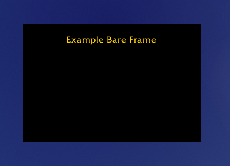
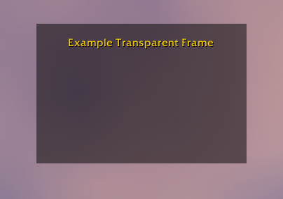
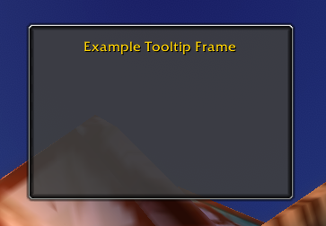

# Frames

XML frame recipes. No Lua, no logic — just the frame definitions.

| <a href="#bare-frame"><br/>Bare</a> | <a href="#transparent-frame"><br/>Transparent</a> | <a href="#tooltip-frame"><br/>Tooltip</a> |
|:---:|:---:|:---:|

---

## Bare frame

A minimal frame with a solid background and no border.


### The frame

```xml
<Frame name="ExampleFrameBare" parent="UIParent"
       enableMouse="true"
       frameStrata="MEDIUM" hidden="true">
  <Size x="240" y="160"/>
  <Anchors>
    <Anchor point="CENTER"/>
  </Anchors>
  <Layers>
    <Layer level="BACKGROUND">
      <Texture setAllPoints="true">
        <Color r="0" g="0" b="0" a="1"/>
      </Texture>
    </Layer>
    <Layer level="ARTWORK">
      <FontString name="$parentTitle" inherits="GameFontNormal"
                  text="Example Bare Frame">
        <Anchors>
          <Anchor point="TOP" relativePoint="TOP" y="-16"/>
        </Anchors>
      </FontString>
    </Layer>
  </Layers>
</Frame>
```

### Live demo

Install the addon in [Addons/ExampleFrameBare_Vertex](./Addons/ExampleFrameBare_Vertex/) and use `/ev1` to toggle the frame in-game.

---

## Transparent frame

A bare frame with a semi-transparent background. The game world is visible through it.


### The frame

```xml
<Frame name="ExampleFrameTransparent" parent="UIParent"
       enableMouse="true"
       frameStrata="MEDIUM" hidden="true">
  <Size x="240" y="160"/>
  <Anchors>
    <Anchor point="CENTER"/>
  </Anchors>
  <Layers>
    <Layer level="BACKGROUND">
      <Texture setAllPoints="true">
        <Color r="0" g="0" b="0" a="0.5"/>
      </Texture>
    </Layer>
    <Layer level="ARTWORK">
      <FontString name="$parentTitle" inherits="GameFontNormal"
                  text="Example Transparent Frame">
        <Anchors>
          <Anchor point="TOP" relativePoint="TOP" y="-16"/>
        </Anchors>
      </FontString>
    </Layer>
  </Layers>
</Frame>
```

### frameStrata and draw order

`frameStrata` controls which rendering layer the frame occupies. Frames in a higher
strata always draw on top of frames in a lower one, regardless of their Z-order within
that strata.

Common values from bottom to top: `BACKGROUND`, `LOW`, `MEDIUM`, `HIGH`,
`DIALOG`, `FULLSCREEN`, `FULLSCREEN_DIALOG`, `TOOLTIP`.

A transparent frame placed in the wrong strata can be obscured by other frames or,
conversely, block UI elements it should sit behind.

### Live demo

Install the addon in [Addons/ExampleFrameTransparent_Vertex](./Addons/ExampleFrameTransparent_Vertex/) and use `/ev2` to toggle the frame in-game.

---

## Tooltip frame

A frame combining the rounded `NineSlicePanelTemplate` border with a semi-transparent background.


### The frame

```xml
<Frame name="ExampleFrameTooltip" parent="UIParent"
       enableMouse="true"
       frameStrata="MEDIUM" hidden="true">
  <Size x="240" y="160"/>
  <Anchors>
    <Anchor point="CENTER"/>
  </Anchors>
  <Frames>
    <Frame inherits="NineSlicePanelTemplate" useParentLevel="true" setAllPoints="true">
      <KeyValues>
        <KeyValue key="layoutType" value="TooltipDefaultLayout" type="string"/>
      </KeyValues>
      <Layers>
        <Layer level="BACKGROUND" textureSubLevel="1">
          <Texture>
            <Anchors>
              <Anchor point="TOPLEFT" x="4" y="-4"/>
              <Anchor point="BOTTOMRIGHT" x="-4" y="4"/>
            </Anchors>
            <Color r="0" g="0" b="0" a="0.5"/>
          </Texture>
        </Layer>
      </Layers>
    </Frame>
  </Frames>
  <Layers>
    <Layer level="ARTWORK">
      <FontString name="$parentTitle" inherits="GameFontNormal"
                  text="Example Tooltip Frame">
        <Anchors>
          <Anchor point="TOP" relativePoint="TOP" y="-16"/>
        </Anchors>
      </FontString>
    </Layer>
  </Layers>
</Frame>
```

### Key attributes

| Attribute | Value | Why |
|---|---|---|
| `enableMouse="true"` | true | Required for drag/click; without this, clicks pass through to the game world even when the frame is visible |
| `frameStrata` | `MEDIUM` | Renders above world, below UI chrome |
| `hidden="true"` | true | Frame starts hidden |

### Background and border

The old XML `<Backdrop>` element is defunct in retail WoW — it is silently ignored.
The modern equivalent is two separate concerns:

**Border** — a child `Frame` inheriting `NineSlicePanelTemplate`.
`TooltipDefaultLayout` gives the rounded tooltip-style border (no title-bar overhang).
The layout includes its own center fill atlas at `textureSubLevel="0"` in the
BACKGROUND layer of the NineSlice child frame.

**Background fill** — a plain `<Color>` texture placed inside the same NineSlice
child frame at `textureSubLevel="1"`. Because higher sub-levels render in front,
this covers the built-in center atlas and replaces it with a semi-transparent color.
The 4px insets keep the fill inside the border edge.

### Live demo

Install the addon in [Addons/ExampleFrameTooltip_Vertex](./Addons/ExampleFrameTooltip_Vertex/) and use `/ev3` to toggle the frame in-game.
