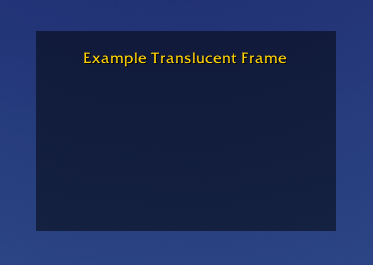
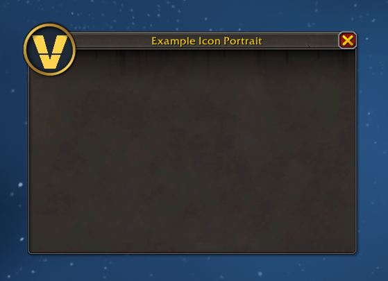
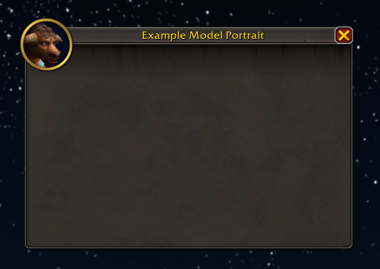

# Frames

XML frame recipes. No Lua, no logic — just the frame definitions.

| <a href="#bare-frame"><br/>Bare</a> | <a href="#translucent-frame"><br/>Translucent</a> | <a href="#tooltip-frame"><br/>Tooltip</a> | <a href="#icon-portrait"><br/>Icon Portrait</a> | <a href="#model-portrait"><br/>Model Portrait</a> |
|:---:|:---:|:---:|:---:|:---:|

---

## Bare frame

A minimal frame with a solid background and no border.


### The frame

```xml
<Frame name="ExampleFrameBare" parent="UIParent"
       enableMouse="true"
       frameStrata="MEDIUM" hidden="true">
  <Size x="240" y="160"/>
  <Anchors>
    <Anchor point="CENTER"/>
  </Anchors>
  <Layers>
    <Layer level="BACKGROUND">
      <Texture setAllPoints="true">
        <Color r="0" g="0" b="0" a="1"/>
      </Texture>
    </Layer>
    <Layer level="ARTWORK">
      <FontString name="$parentTitle" inherits="GameFontNormal"
                  text="Example Bare Frame">
        <Anchors>
          <Anchor point="TOP" relativePoint="TOP" y="-16"/>
        </Anchors>
      </FontString>
    </Layer>
  </Layers>
</Frame>
```

### Live demo

Install the addon in [Addons/ExampleFrameBare___Vertex](./Addons/ExampleFrameBare___Vertex/) and use `/ev1` to toggle the frame in-game.

---

## Translucent frame

A bare frame with a translucent background. The game world is visible through it.


### The frame

```xml
<Frame name="ExampleFrameTranslucent" parent="UIParent"
       enableMouse="true"
       frameStrata="MEDIUM" hidden="true">
  <Size x="240" y="160"/>
  <Anchors>
    <Anchor point="CENTER"/>
  </Anchors>
  <Layers>
    <Layer level="BACKGROUND">
      <Texture setAllPoints="true">
        <Color r="0" g="0" b="0" a="0.5"/>
      </Texture>
    </Layer>
    <Layer level="ARTWORK">
      <FontString name="$parentTitle" inherits="GameFontNormal"
                  text="Example Translucent Frame">
        <Anchors>
          <Anchor point="TOP" relativePoint="TOP" y="-16"/>
        </Anchors>
      </FontString>
    </Layer>
  </Layers>
</Frame>
```

### frameStrata and draw order

`frameStrata` controls which rendering layer the frame occupies. Frames in a higher
strata always draw on top of frames in a lower one, regardless of their Z-order within
that strata.

Common values from bottom to top: `BACKGROUND`, `LOW`, `MEDIUM`, `HIGH`,
`DIALOG`, `FULLSCREEN`, `FULLSCREEN_DIALOG`, `TOOLTIP`.

A translucent frame placed in the wrong strata can be obscured by other frames or,
conversely, block UI elements it should sit behind.

### Live demo

Install the addon in [Addons/ExampleFrameTranslucent__Vertex](./Addons/ExampleFrameTranslucent__Vertex/) and use `/ev2` to toggle the frame in-game.

---

## Tooltip frame

A frame combining the rounded `NineSlicePanelTemplate` border with a semi-translucent background.


### The frame

```xml
<Frame name="ExampleFrameTooltip" parent="UIParent"
       enableMouse="true"
       frameStrata="MEDIUM" hidden="true">
  <Size x="240" y="160"/>
  <Anchors>
    <Anchor point="CENTER"/>
  </Anchors>
  <Frames>
    <Frame inherits="NineSlicePanelTemplate" useParentLevel="true" setAllPoints="true">
      <KeyValues>
        <KeyValue key="layoutType" value="TooltipDefaultLayout" type="string"/>
      </KeyValues>
      <Layers>
        <Layer level="BACKGROUND" textureSubLevel="1">
          <Texture>
            <Anchors>
              <Anchor point="TOPLEFT" x="4" y="-4"/>
              <Anchor point="BOTTOMRIGHT" x="-4" y="4"/>
            </Anchors>
            <Color r="0" g="0" b="0" a="0.5"/>
          </Texture>
        </Layer>
      </Layers>
    </Frame>
  </Frames>
  <Layers>
    <Layer level="ARTWORK">
      <FontString name="$parentTitle" inherits="GameFontNormal"
                  text="Example Tooltip Frame">
        <Anchors>
          <Anchor point="TOP" relativePoint="TOP" y="-16"/>
        </Anchors>
      </FontString>
    </Layer>
  </Layers>
</Frame>
```

### Key attributes

| Attribute | Value | Why |
|---|---|---|
| `enableMouse="true"` | true | Required for drag/click; without this, clicks pass through to the game world even when the frame is visible |
| `frameStrata` | `MEDIUM` | Renders above world, below UI chrome |
| `hidden="true"` | true | Frame starts hidden |

### Background and border

The old XML `<Backdrop>` element is defunct in retail WoW — it is silently ignored.
The modern equivalent is two separate concerns:

**Border** — a child `Frame` inheriting `NineSlicePanelTemplate`.
`TooltipDefaultLayout` gives the rounded tooltip-style border (no title-bar overhang).
The layout includes its own center fill atlas at `textureSubLevel="0"` in the
BACKGROUND layer of the NineSlice child frame.

**Background fill** — a plain `<Color>` texture placed inside the same NineSlice
child frame at `textureSubLevel="1"`. Because higher sub-levels render in front,
this covers the built-in center atlas and replaces it with a semi-translucent color.
The 4px insets keep the fill inside the border edge.

### Live demo

Install the addon in [Addons/ExampleFrameTooltip__Vertex](./Addons/ExampleFrameTooltip__Vertex/) and use `/ev3` to toggle the frame in-game.

---

## Icon portrait

A frame using `PortraitFrameTemplate` with a custom icon texture as the portrait.


### The frame

```xml
<Frame name="ExampleFrameIconPortrait" parent="UIParent"
       toplevel="true" enableMouse="true" movable="true"
       frameStrata="MEDIUM" hidden="true"
       inherits="PortraitFrameTemplate">
  <Size x="380" y="260"/>
  <Anchors>
    <Anchor point="CENTER"/>
  </Anchors>
  <Scripts>
    <OnLoad>
      self:RegisterForDrag("LeftButton")
    </OnLoad>
    <OnDragStart>
      self:StartMoving()
    </OnDragStart>
    <OnDragStop>
      self:StopMovingOrSizing()
    </OnDragStop>
  </Scripts>
</Frame>
```

### What PortraitFrameTemplate provides

`PortraitFrameTemplate` is a Blizzard-supplied virtual frame that wires up the
standard WoW panel chrome — title bar, close button, border, and a portrait slot —
all accessible as named children on the frame:

| Key | Type | Purpose |
|---|---|---|
| `frame.TitleText` | FontString | Title label in the header bar |
| `frame.Portrait` | Texture | Circular portrait image in the top-left |
| `frame.CloseButton` | Button | Hides the frame when clicked |

The template does not register the frame for dragging — that is done explicitly in
`OnLoad` and the `OnDragStart` / `OnDragStop` scripts above.

### Populating the portrait

Portrait content is set in Lua after the frame is created. The XML loads first, then
the Lua file runs at addon load time:

```lua
ExampleFrameIconPortrait:SetTitle("Example Icon Portrait")
ExampleFrameIconPortrait:SetPortraitToAsset("Interface\\AddOns\\ExampleFrameIconPortrait__Vertex\\vertex-icon")
ExampleFrameIconPortrait:SetPortraitTextureSizeAndOffset(64, -6, 10)
```

`SetPortraitToAsset` and `SetPortraitTextureSizeAndOffset` are methods provided by
`PortraitFrameTemplate` — use these rather than calling `SetPortraitToTexture` on
`frame.Portrait` directly. The size and offset control how the texture is positioned
within the circular portrait area.

To show a unit portrait instead (player's class icon, race, etc.):

```lua
SetPortraitTexture(ExampleFrameIconPortrait.Portrait, "player")
```

### Live demo

Install the addon in [Addons/ExampleFrameIconPortrait__Vertex](./Addons/ExampleFrameIconPortrait__Vertex/) and use `/ev4` to toggle the frame in-game. The addon includes `vertex-icon.png` as the example portrait texture.

---

## Model portrait

A frame containing a `DressUpModel` widget that renders the player's 3D character.


### The frame

```xml
<Frame name="ExampleFrameModelPortrait" parent="UIParent"
       enableMouse="true"
       frameStrata="MEDIUM" hidden="true">
  <Size x="240" y="240"/>
  <Anchors>
    <Anchor point="CENTER"/>
  </Anchors>
  <Layers>
    <Layer level="BACKGROUND">
      <Texture setAllPoints="true">
        <Color r="0" g="0" b="0" a="1"/>
      </Texture>
    </Layer>
  </Layers>
  <Frames>
    <DressUpModel parentKey="Model" setAllPoints="true"/>
  </Frames>
</Frame>
```

### DressUpModel vs PlayerModel

Both are 3D model widget types, but they behave differently:

**`PlayerModel`** tracks the live character in the world — camera and position are
coupled to the player's in-game location, which produces inconsistent framing in
a UI panel.

**`DressUpModel`** (used by the Character pane and Auction House try-on) is decoupled
from the world. It displays the character's current appearance in a fixed viewport,
which is what you want for a portrait. Unit is assigned in Lua — `unit="player"` is
not a valid XML attribute and silently does nothing.

The harness calls two functions at show-time:

```lua
f.Model:SetUnit("player")   -- load the player's appearance
f.Model:SetCamera(0)        -- full-body portrait camera
```

`parentKey="Model"` makes the child accessible as `frame.Model` from Lua.

### Live demo

Install the addon in [Addons/ExampleFrameModelPortrait__Vertex](./Addons/ExampleFrameModelPortrait__Vertex/) and use `/ev5` to toggle the frame in-game. The harness calls `SetUnit` and `SetCamera` each time the frame is shown.
